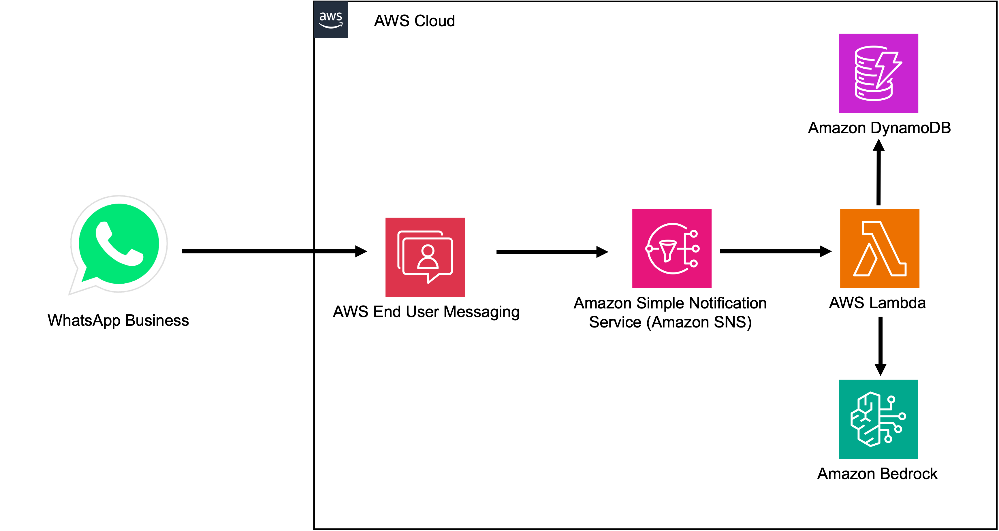

## WhatsApp and AWS Integration

### Overview

This is a **demo** project. It's a non-profit project and will not SPAM users.

It'was build to show AWS users, developers and community how to integrate AWS with Meta WhatsApp.

It integrates WhatsApp for Business (from Meta) with AWS services as [AWS End User Messaging Social](https://docs.aws.amazon.com/social-messaging/latest/userguide/getting-started-whatsapp.html), that will integrate AWS infrastructure with WhatsApp and [Amazon Bedrock](https://aws.amazon.com/bedrock/) the easiest way to build and scale generative AI applications with foundation models, to interact with users.

### Disclaimer

This is not a marketing tool, or advertisment one. It's an educational tool only. It will only interact with people that send messages to this tool, which means, it'll be only accessed by people who wants to learn more about this architecture and AWS.

This project is based on this [this](https://community.aws/content/2m2kHWQAI5z51j706VuZGnJgKEw/processing-whatsapp-multimedia-with-amazon-bedrock-agents-images-video-and-documents) AWS Blog.

### Architecture

This is AWS architecture Diagram:

### Security

If you discover a potential security issue in this project I ask that you notify author on support methods.

### Support

For any issues, please contact author, Evandro Franco, on [Github](https://github.com/evandrofranco) or [LinkedIn](https://www.linkedin.com/in/evandrogfranco/).